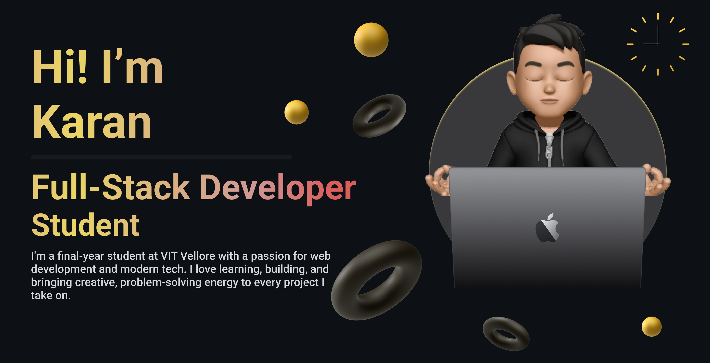

# 💫 About Me  
🧑‍🎓 I'm a final-year Computer Science Engineering student, full-stack developer, and UI/UX designer.  
👨‍💼 Chairperson at [CodeChef-VIT](https://github.com/CodeChefVIT), where I lead initiatives to promote development, open source, and competitive programming.
🛠️ I love crafting clean, efficient, and user-centric web applications.  
🎨 Passionate about intuitive design and seamless user experiences.  
🌐 Currently learning Next.js and exploring performance optimization.  

# 💻 Tech Stack:
                   

# My Contribution:

<picture>
  <source media="(prefers-color-scheme: dark)" srcset="https://github.com/IshanJ25/IshanJ25/blob/output/snek_dark.svg">
  <source media="(prefers-color-scheme: light)" srcset="https://github.com/IshanJ25/IshanJ25/blob/output/snek_light.svg">
  
</picture>

  

# 🌐 Socials:
   

# 🚀 Projects

- 🔍 [**Papers – By Students For Students**](https://papers.codechefvit.com)  
  A collaborative platform with over 42K unique users where students can upload, search, and access previous year university papers, filters included. Built using **Next.js**, **MongoDB**, and **Tailwind CSS**.

- 🤖 [**GenCode**](https://gencode.karnx.dev)  
  An AI-powered MERN stack platform that generates competitive coding problems from user prompts. Features include a code editor, problem-solving history, and user performance tracking.

- 🧠 [**SentraAI**](https://github.com/karannfr/SentraAI)  
  A cybersecurity-focused AI middleware that sanitizes, de-obfuscates, and secures LLM inputs using multi-layered defense techniques. Built with **Node.js**, **LangGraph**, and **Ollama**.

- 🗓️ [**FFCS by CodeChef-VIT**](https://ffcs.codechefvit.com)  
  A FFCS automation tool designed to streamline the course registration process at VIT. Empowered 10K+ students to create optimized timetables effortlessly.

- 🧠 [**Quiztelify**](https://quiztelify.karnx.dev)  
  Practice platform for NPTEL quizzes. Supports PDF uploads and preloaded courses. Uses **Gemini 2.0 & 2.5 APIs** smartly to bypass token limitations and parsing issues.

and building many more :)
